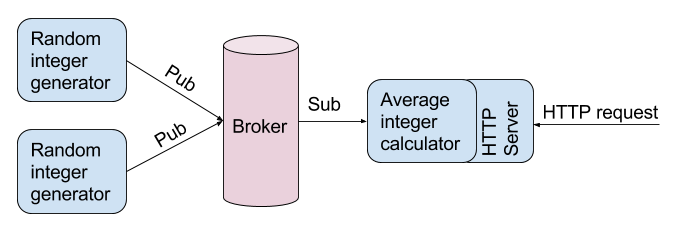

# Software Engineer / DevOps challenge

This is a challenge for the Software Engineer / DevOps at [snuk.io](http://snuk.io).

For the general information about the challenges please check the [README.md](/README.md).


## Average integer calculator

The system you need to implement consists of the following components:

- A message broker
- Two instances of random integer generator
- Integer average calculator

All the components should be run with docker. The details of what each of the components should do are below.

You need to do the following:

- Write the simple random integer generator
- Write the integer average calculator
- Write configuration and/or explain how to run it locally
- Describe how'd you provision a set of linux machines and how'd you orchestrate, monitor and troubleshoot these services.


### Message broker

The services are communicating through a message broker. You can use any protocol and broker you like. The simpler the better.

If you don't have any preferences we suggest to use [mosquitto](https://mosquitto.org/). You can run mosquitto using the `toke/mosquitto` image:
```
docker run -it -p 1883:1883 --name=mosquitto  toke/mosquitto
```

### Random integer generators

You need to write and run two instances of the following simple service:

- every 100ms generates a random integer from 1 to 10000
- the value gets pushed through the message broker of your choice


### Integer average calculator

And the final service you need to write and run:

- subscribes to the topic where generators publish the values
- computes the average integer for the last 5 seconds
- exposes an http endpoint where this computed value could be obtained via GET request

At the end it should roughly look like this:




### Hints

- You're free to use any languages and any libraries. As we use `go` at snuk, we'd be pleased if you used `go` if you are familiar with it.

- The fastest way to get mqtt broker is to run mosquitto with docker:
    ```
    docker run -it -p 1883:1883 --name=mosquitto  toke/mosquitto
    ```
